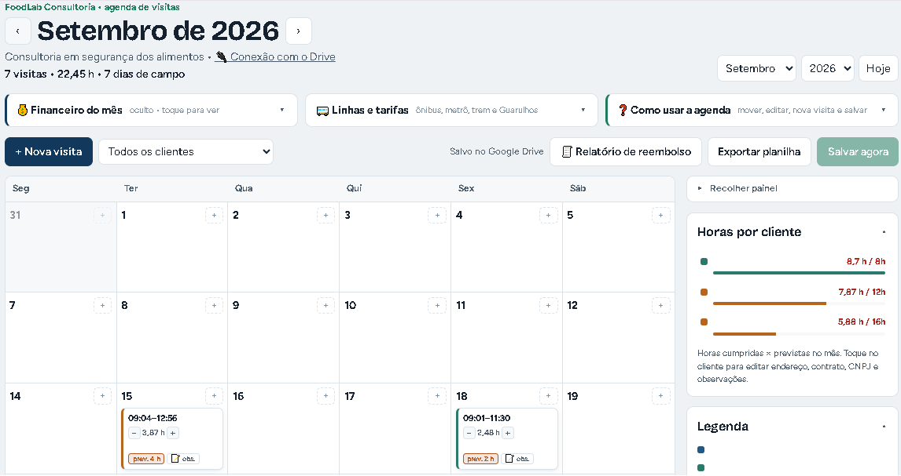
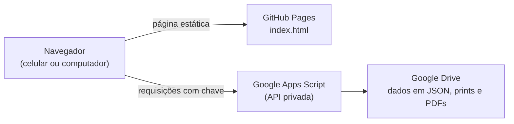

# Agenda FoodLab

Aplicativo web para planejar e controlar as visitas de consultoria em segurança dos alimentos da **FoodLab Consultoria**. Ele reúne em um só lugar a agenda do mês, as horas trabalhadas por cliente, o custo de transporte público e o relatório de reembolso em PDF.

🔗 **App:** https://felipelima1991.github.io/agenda-foodlab/

*Tela do mês com os nomes dos clientes ocultos.*

> O app é privado na prática: a página publicada não contém dados. Agenda, clientes e valores ficam no Google Drive do proprietário e só aparecem depois de conectar com uma chave de acesso.

---

## O problema

Um consultor que atende vários estabelecimentos em regiões diferentes da cidade precisa:

- encaixar visitas de horas contratadas diferentes em poucos dias de campo;
- conferir se as horas cumpridas batem com as horas contratadas de cada cliente;
- saber quanto gasta de ônibus, metrô e trem em cada deslocamento;
- prestar contas desses gastos para reembolso, com comprovante do percurso.

Planilhas soltas e anotações no celular não davam conta disso. O Agenda FoodLab resolve tudo na mesma tela, no computador e no celular, sempre sincronizado.

## Funcionalidades

**Agenda**
- Calendário mensal de segunda a sábado, com blocos de visita arrastáveis entre os dias.
- Hora de entrada e hora de saída em cada visita, com cálculo automático das horas.
- Horas previstas × horas cumpridas, com destaque quando são diferentes.
- Ajuste rápido de meia em meia hora direto no bloco (−/+).
- Cores por região da cidade, situação da visita (agendada, realizada, cancelada) e feriados.
- Abre sempre no mês atual, já posicionado no dia de hoje.

**Clientes**
- Cadastro com endereço, contrato, horas mensais esperadas, razão social, CNPJ e orientações de como chegar.
- Painel de horas por cliente no mês, com barra de progresso em relação ao contrato.

**Transporte**
- Endereço de partida e de destino em cada visita, com botão que abre a rota de transporte público no Google Maps.
- Custo de cada trecho calculado automaticamente: ida até cada cliente e volta para casa, incluindo integração do Bilhete Único e tarifa intermunicipal.
- Qualquer valor pode ser corrigido manualmente.

**Financeiro**
- Faturamento pelas horas cumpridas.
- Transporte tratado como gasto adiantado e reembolsável, somado ao total a receber.
- Tabela de notas fiscais por cliente (número e situação: a emitir, emitida, paga).
- Exportação para planilha (CSV) no Google Drive.

**Relatório de reembolso**
- Uma linha por trecho, com data da despesa, centro de custo, projeto (cliente), descrição do valor e print do percurso.
- Envio do print pelo celular direto para o Google Drive.
- Lista de conferência obrigatória antes de gerar o relatório.
- PDF gerado e salvo automaticamente no Google Drive.

## Como funciona

- **GitHub Pages** hospeda só a interface (HTML, CSS e JavaScript em um único arquivo). Nenhum dado pessoal fica no repositório.
- **Google Apps Script** funciona como uma API privada: recebe as requisições do app, confere a chave de acesso e lê ou grava no Drive.
- **Google Drive** guarda a agenda em um arquivo JSON, os prints de percurso e os relatórios em PDF.

Outros pontos técnicos:
- Salvamento automático alguns segundos depois de cada alteração.
- Controle de versão do arquivo de dados: se dois aparelhos editarem ao mesmo tempo, o app detecta o conflito em vez de sobrescrever.
- Cópia local no aparelho para não perder alterações quando a internet cai.
- Imagens reduzidas no próprio celular antes do envio, para economizar dados.
- Layout responsivo com tema claro e escuro.

## Tecnologias

- HTML, CSS e JavaScript puro, sem frameworks
- Google Apps Script (`doPost`, `DriveApp`, `DocumentApp`, `LockService`, `PropertiesService`)
- GitHub Pages
- Google Maps URLs (rotas de transporte público)

## Instalação

**1. Servidor (Google Apps Script)**
1. Crie um projeto em [script.google.com](https://script.google.com) e cole o conteúdo do `Code.gs`.
2. Selecione a função `gerarChave`, clique em **Executar** e copie a chave exibida no registro de execução.
3. Em **Implantar > Nova implantação > App da Web**, escolha *Executar como: Eu* e *Quem pode acessar: Qualquer pessoa*.
4. Copie o link do app da web, que termina em `/exec`.

**2. Página (GitHub Pages)**
1. Envie o `index.html` para a raiz do repositório.
2. Em **Settings > Pages**, escolha *Deploy from a branch*, depois a branch `main` e a pasta `/ (root)`.

**3. Primeiro acesso**
1. Abra o endereço do GitHub Pages.
2. Informe o link `/exec` e a chave. A conexão fica salva naquele aparelho.
3. No Android, use **⋮ > Adicionar à tela inicial** para ter um atalho como aplicativo.

## Segurança

- O repositório é público, mas o `index.html` não contém dados pessoais nem de clientes.
- O `Code.gs` e os dados ficam somente na conta Google do proprietário.
- Toda requisição exige a chave de acesso. Para trocar a chave, basta executar `gerarChave` novamente.
- Nunca publique a chave em arquivos do repositório.
- O botão **Desconectar este aparelho** apaga a chave e a cópia local de um aparelho sem afetar os dados do Drive.

## Autor

**Felipe** — engenheiro de alimentos (CREA-SP), CEO da FoodLab Consultoria e estudante do Bacharelado em Ciência de Dados da Univesp.

Projeto criado para resolver uma necessidade real do dia a dia de consultoria, unindo conhecimento de segurança dos alimentos, organização de dados e automação.
